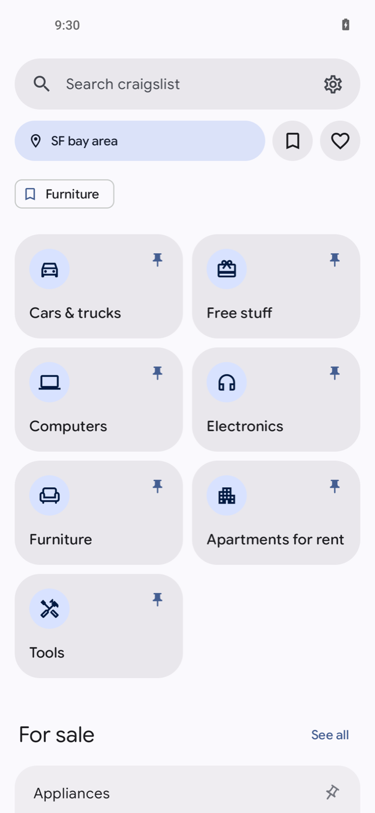
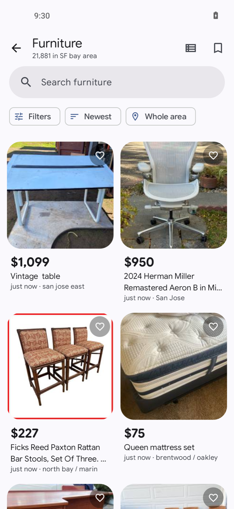
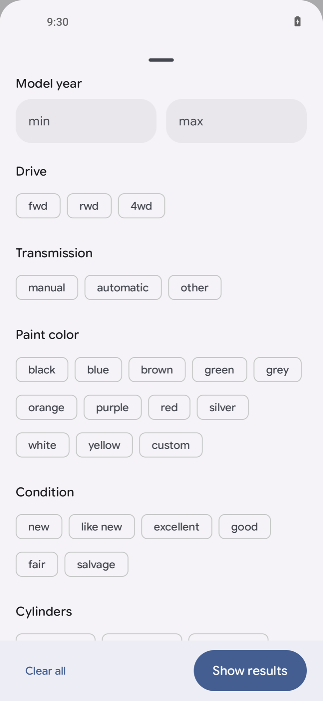
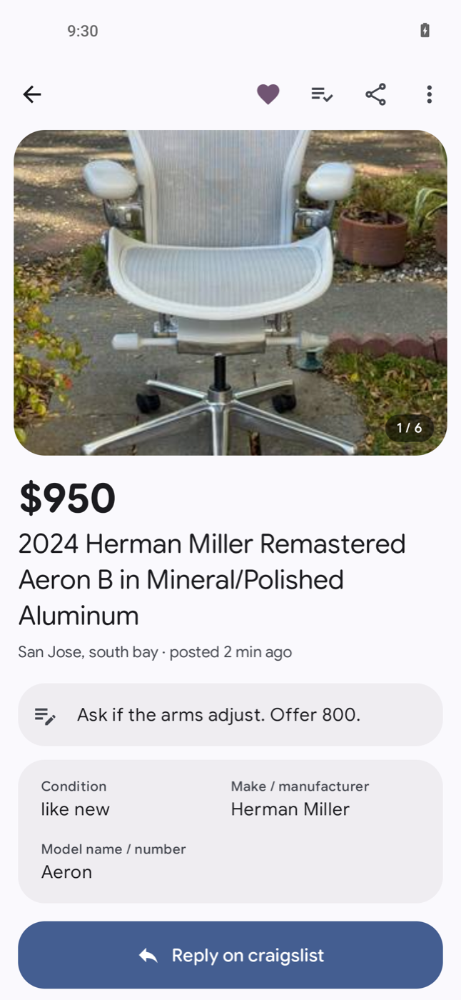
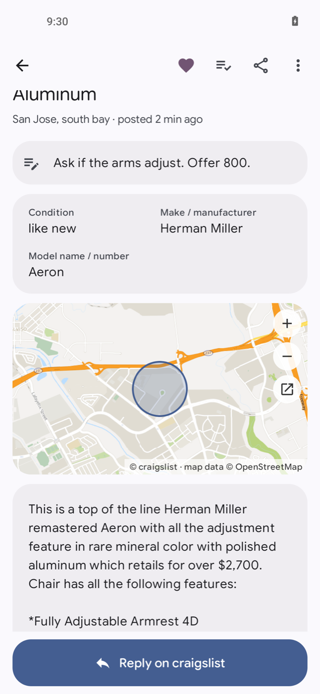
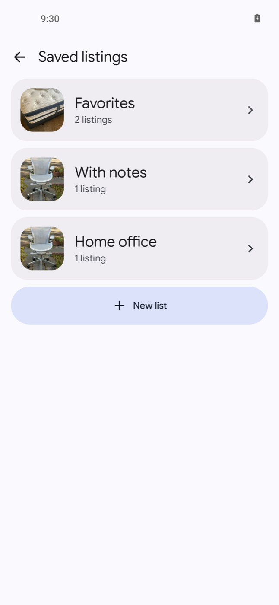
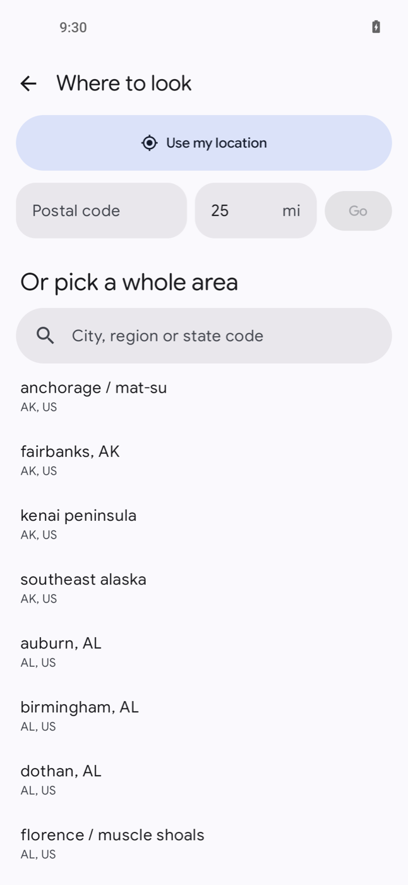
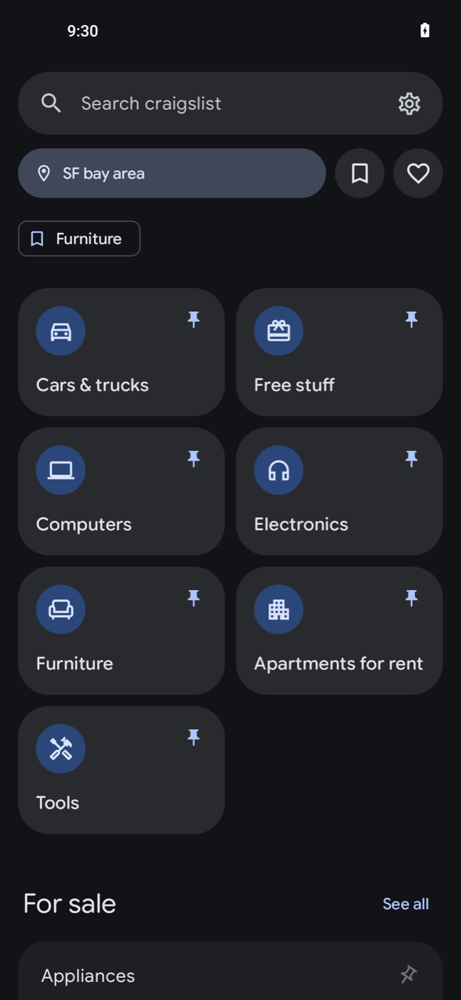
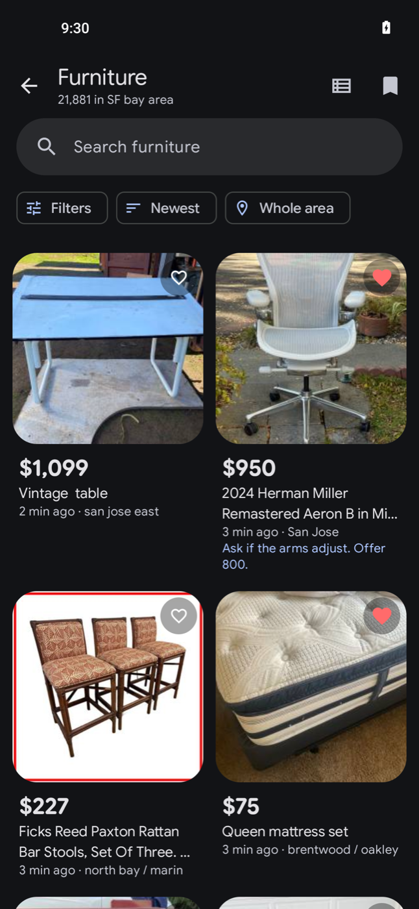

<div align="center">


# Corkboard

**A better craigslist app for Android. No Google services needed.**

[](https://apps.obtainium.imranr.dev/redirect?r=obtainium://add/https://github.com/PimpinPumpkin/corkboard)&nbsp;&nbsp;[](https://github.com/PimpinPumpkin/corkboard/releases/latest)

Android 10 or later. Tap a button, install, done. No account.

</div>

| Home | Results | Filters | Listing | Map and details |
|:-:|:-:|:-:|:-:|:-:|
|  |  |  |  |  |

| Saved lists | Where to look | Dark: home | Dark: results |
|:-:|:-:|:-:|:-:|
|  |  |  |  |

## Features

- **Every filter craigslist has.** Make and model, year, odometer and title status for cars;
  bedrooms, pets and laundry for housing; and so on for every category.
- **Search near you.** Use your location or a postal code and a distance, and hide results from
  across the border.
- **Light and dark themes**, grid or list, photos you can pinch to zoom, and the choice of whole
  or cropped photos.
- **A map on every listing**, with no maps app needed.
- **Favorites, your own lists, and private notes.** Share a list or save it as a spreadsheet.
- **Press and hold any listing** for a quick preview with its photos, and like it, add it to a
  list, hide it or share it right there.
- **Back up and restore** everything to one file, and import a list from a spreadsheet.
- **Deleted listings stay readable**, and a changed price shows what it was.
- **Check a whole list at once.** Pull down on any list to see which listings are gone or repriced.
- **Recently viewed**, so the one you closed is easy to find again.
- **See when a seller edits a listing.**
- **Saved searches with alerts**, checked by the phone itself.
- **Pin your categories** to the home screen.
- **Works anywhere craigslist does**, in fifteen languages.
- **Private.** No Corkboard server, no tracking, no account.

Replying and posting open in your browser.

Corkboard is an independent project, not affiliated with craigslist. It is new, so expect a bug or
two; [open an issue](https://github.com/PimpinPumpkin/corkboard/issues) if you find one.

---

## More

<details>
<summary><b>Installing and updates</b></summary>

<br>

**Obtainium** (recommended) installs the app and keeps it updated. **Download APK** takes you to
the latest release: download the `.apk` file and open it.

There is one release channel. Every release is signed with the same key, so each installs over
the last.

</details>

<details>
<summary><b>Check you got the real thing</b></summary>

<br>

Every Corkboard APK, from any channel, is signed with the same key. Its certificate fingerprint is:

```
SHA-256  BB:9F:49:EC:3A:7D:EA:7E:20:BA:CE:33:AA:CB:0B:B4:C8:C3:D6:39:B1:35:30:93:4A:53:D4:0A:7D:82:F5:EB
```

Check a downloaded file against it before installing:

```bash
apksigner verify --print-certs corkboard-*.apk
```

On the phone, [App Verifier](https://github.com/soupslurpr/AppVerifier) checks the same thing. It
wants the package name on the first line and the fingerprint on the second:

```
app.corkboard
BB:9F:49:EC:3A:7D:EA:7E:20:BA:CE:33:AA:CB:0B:B4:C8:C3:D6:39:B1:35:30:93:4A:53:D4:0A:7D:82:F5:EB
```

Android enforces this for you after the first install: an update signed with a different key is
refused.

</details>

<details>
<summary><b>Alerts, the small print</b></summary>

<br>

Alerts are checked by the phone itself, the way a de-Googled alarm or reminder app has to work:
there is no server watching craigslist for you and no push message to wake the app.

- **Android decides when the check runs.** By default it may delay or skip background work to save
  battery, sometimes for many hours. For alerts you can rely on, open the app's page in system
  settings and set **App battery usage** to **Unrestricted**. The saved searches screen has a
  button that takes you there.
- **Still not instant.** Checks are about three hours apart on purpose, and can be later while the
  phone sits idle or battery saver is on. Something that sells in twenty minutes will be gone.
- **Needs a network** at the time of the check, and notification permission.
- **Some phones are stricter.** Makers that kill background apps aggressively may need the app
  allowed to run in the background as well; [dontkillmyapp.com](https://dontkillmyapp.com) lists
  what each one needs.
- **Light on the battery.** One small request per saved search per check, no constant connection,
  and nothing at all when no search has alerts on.

</details>

<details>
<summary><b>Privacy</b></summary>

<br>

There is no Corkboard server. Nothing you do in the app is sent to anyone but craigslist, and
craigslist sees what it would see from a browser. The one other request the app makes is for a
settings file kept in this repository.

| What you do | Who hears about it |
| --- | --- |
| Open a category, search, change a filter | **craigslist**, as an anonymous visitor |
| Open a listing, look at its photos and map | **craigslist.** The map tiles are craigslist's own, the ones its web page uses |
| First launch | **craigslist**, once, to learn which site is nearest your network address |
| Tap "Use my location" | **craigslist**, with coordinates rounded to about a kilometer. Only when you tap it |
| Heart, hide, note, add to a list, save a search | **Nobody.** It stays in the app's private storage |
| Once a day, in the background | **GitHub**, for a small signed settings file from this repository that lets a craigslist change be fixed without an app update. It says nothing about you |
| Saved-search alerts | **craigslist**, the same search a few times a day. No push service in between |
| Reply to a listing | **Your browser** takes over |

No analytics, no crash reporting, no accounts, no advertising identifiers. The only cookie is the
one craigslist gives every browser, and Settings can clear it.

</details>

<details>
<summary><b>How it works</b></summary>

<br>

- **The same requests as the web page.** Search results, listing details and make-and-model
  suggestions come from the JSON endpoints craigslist's own search page calls, in the same sequence
  the page uses.
- **Chromium's network stack.** Every request goes through Cronet, the network library inside
  Chrome, so the app is on the wire what it says it is: Chrome on Android, at the version of Cronet
  in the APK.
- **At your pace.** A request happens when you do something. Results are reused for as long as the
  site says they may be. Saved searches are checked a few times a day, one at a time.
- **One phone, one visitor.** Nothing is pooled, proxied or shared between users.

</details>

<details>
<summary><b>Building and contributing</b></summary>

<br>

```bash
./gradlew assembleDebug
```

JDK 17 and Android SDK platform 37.0. The first build downloads a prebuilt Cronet (15 MB).

```bash
./gradlew testDebugUnitTest
```

runs the tests: the parsers against trimmed real responses, the request shapes, and the exports.

Issues and pull requests are welcome. Two house rules, both checked by `scripts/check-writing.sh`
and by CI: US English, and no em dashes. Commit subjects are used verbatim as release notes, so
write them as plain sentences about what changed for the person using the app.

If craigslist changes something and the app breaks, the most useful report is the category and
area you were in and what you tapped.

</details>

## License

GPL-3.0. Cronet is from the Chromium project under its BSD license. The typeface is
[Google Sans Flex](https://fonts.google.com/specimen/Google+Sans+Flex), OFL 1.1, see
[licenses/](licenses/GoogleSansFlex-OFL.txt). Map data is © OpenStreetMap contributors, served by
craigslist.

craigslist is a trademark of craigslist, Inc. Corkboard uses the name only to say what it works
with.
